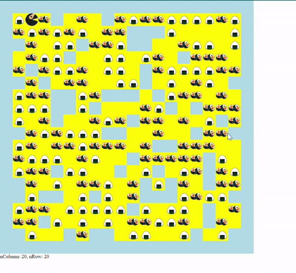

# Javascript_Ninja_man_intermediate
A simple game. Ninja can move 4 directions and eat food. In this intermediate level the number of rows and columns of the world is randomly generated, and the food is randomly placed.

